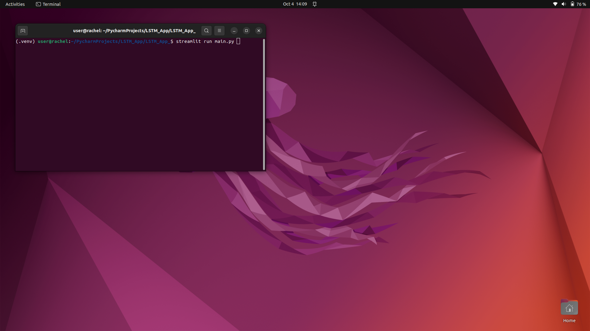
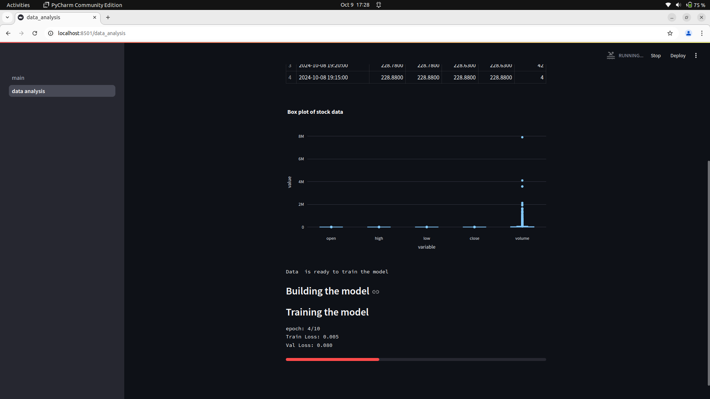
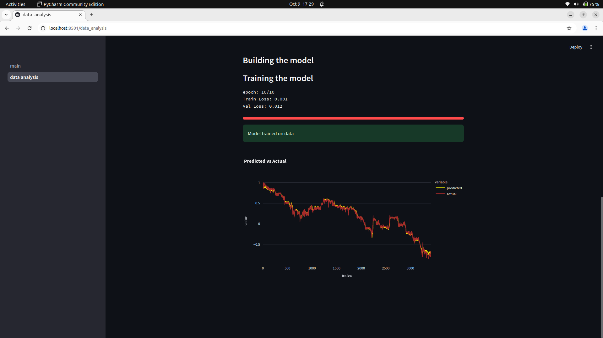

# LSTM Stock Forecasting

THe current app allows users to select their respective choice of the stock, then the app provides 
the actual and the predicted output of the model such that the future performance of the stock can be predicted.
## Table of Contents
- [Features](#features)
- [Installation](#installation)
- [Tools Used](#tools-used)

## Features
- F 1: Timestamp
- F 2: close value of stock

## Application installation
To set up the project, follow these steps:

1. Clone the repository:
2. Build the docker image
<code>docker build -t app_lstm .</code>
3. Run the docker container
<code>docker run -p 8501:8501 app_lstm</code>

## Tools Used

*Data gathering and insertion*

*Model building*

*Model results*

#### Walkthrough

